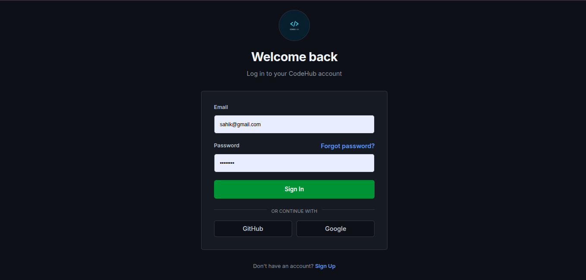
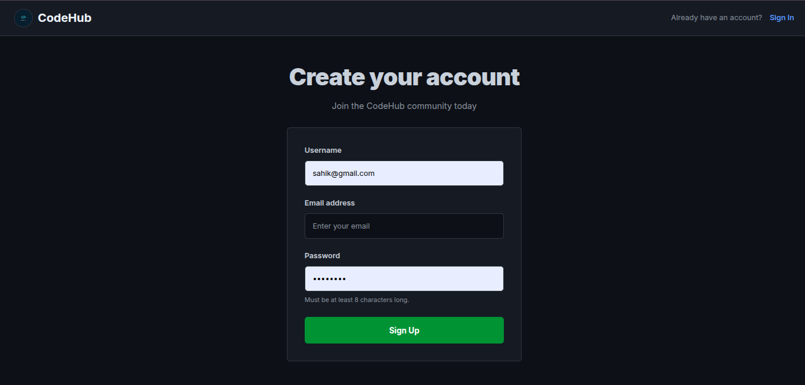
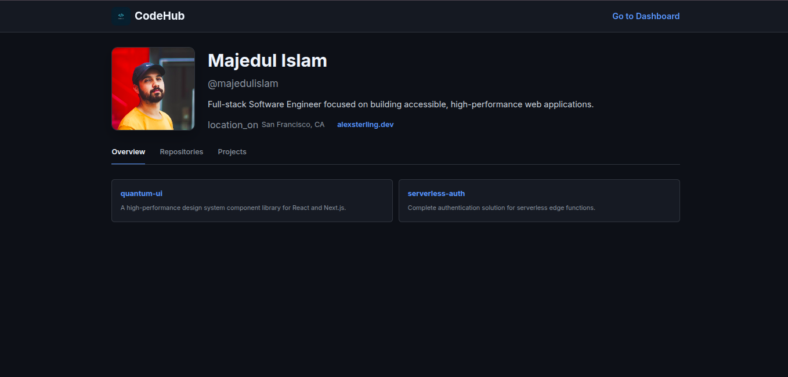
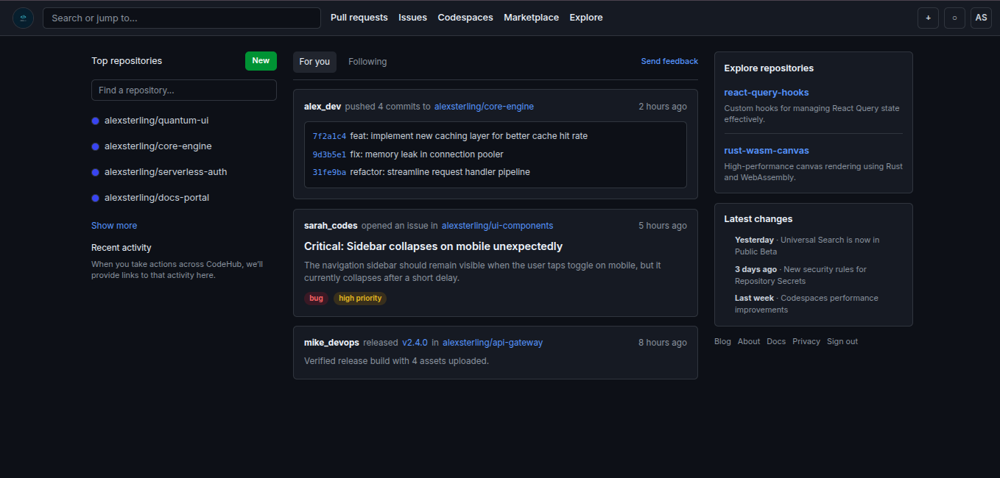

# CodeHub UI

CodeHub is a React + Vite frontend project that provides a GitHub-inspired interface for core developer flows:

- Login
- Sign Up
- Profile
- Dashboard

The project is focused on building modern UI pages and route-based navigation with a consistent visual theme.

## Tech Stack

- React 19
- Vite 7
- React Router DOM 7
- ESLint 9
- Pure CSS (page-level stylesheets)

## Project Structure

```bash
codeHub/
├── public/
├── src/
│   ├── components/
│   │   ├── auth/
│   │   │   ├── Login.jsx
│   │   │   ├── Singup.jsx
│   │   │   ├── login.css
│   │   │   └── sigup.css
│   │   ├── dashboard/
│   │   │   ├── Dashboard.jsx
│   │   │   └── dashboard.css
│   │   └── user/
│   │       ├── Profile.jsx
│   │       └── profile.css
│   ├── App.jsx
│   ├── Routes.jsx
│   ├── authContext.jsx
│   ├── index.css
│   └── main.jsx
├── uiv1/
│   ├── Login.png
│   ├── singup.png
│   ├── prodile.png
│   └── dashboard.png
├── package.json
└── README.md
```

## Available Routes

Configured in `src/Routes.jsx`:

- `/` → redirects to `/login`
- `/login` → Login page
- `/signup` → Signup page
- `/profile` → User profile page
- `/dashboard` → Dashboard page
- `*` → fallback redirect to `/login`

## Getting Started

### 1) Install dependencies

```bash
npm install
```

### 2) Start development server

```bash
npm run dev
```

### 3) Build for production

```bash
npm run build
```

### 4) Preview production build

```bash
npm run preview
```

## Scripts

- `npm run dev` – Start Vite dev server
- `npm run build` – Create production build
- `npm run preview` – Preview production output
- `npm run lint` – Run ESLint checks

## UI Screenshots (uiv1)

### Login



### Signup



### Profile



### Dashboard



## Notes

- Logo asset used in pages: `/logov1.png`
- Route navigation is handled with `react-router-dom`
- Basic auth state container is available via `src/authContext.jsx`
